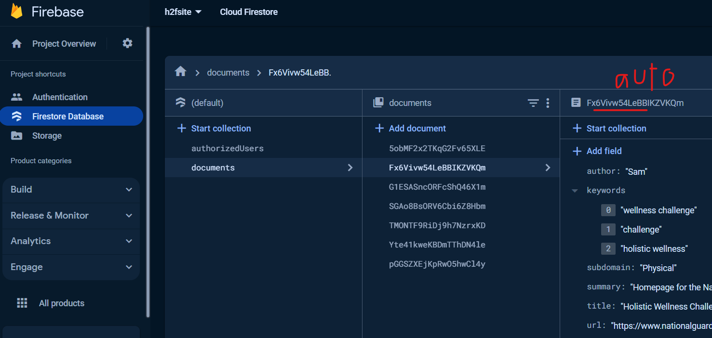
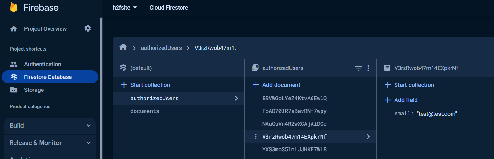

# H2F website

- **Authors**: Sam Nordhus (user: snordhus), Vinay Viswanathan (user: vinayvis821), Victoria
- [**Project URL**](https://h2f.vercel.app/)

### A repository of U.S Army and National Guard documents related to Holistic Health and Fitness(H2F)

The site is open to the public to provide an organized and user-friendly view of important documents.
Users can authenticate and contact a specific U.S. army specialist with questions for each document.

### Track project

A project board can be found [here](https://github.com/users/snordhus/projects/2)

## Ownership Transfer TUTORIAL

Here is a step-by-step guide detailing how to transfer the ownership of the google Firebase. Note: This project was designed with Firebase CLI (v12.6.2).

- **Step 1**: Log-in to the official [Firebase console](https://console.firebase.google.com/) with the email which you would like to own the project
- **Step 2**: Create/add a new firebase project. Name it whatever you would like. You do not need to enable Goggle analytics.
- **Step 3**: Set Up user authentication to the firebase project:
  - From the console, click: Product Categories > Build > Authentication > Get Started > Google (this can be changed with minor code revisions) > Enable > Save
  - Now you must add your authorized domain. Click Authentication > Settings > Authorized domain > add the domain you plan to host the site from (i.e.: "h2f.vercel.app")
- **Step 4**: Set Up Firestore Cloud Database:
  - Click: Product Categories > Build > Firestore Database > Create Database > Next (keep defaults) > Enable
  - The database is created, now you must create 2 collections with case-sensitive names:
  - **1)** Start Collection > name it "**documents**" (spelling/case sensitive)
     -Add the first document, use auto-id, modeling the following fields (all field names are spelling-dependent/case-sensitive):
  - 
  - **2)** Start Collection > name it "**authorizedUsers**" (spelling/case sensitive)
  - add the first document: Use auto-id, and add a single field: "email", and make it's value your email address:
  - 
- **Final Step**: Copy your project's firebaseConfig variable to the codebase:
  - firstly, make sure the repo is cloned on your local dev environment, with node installed
  - Starting from your firebase project homepage > scroll down to "your apps" and add a **web app** > name it anything, it doesn't need hosting if Vercel is set up
  - If you haven't installed firebase yet: run npm install firebase
  - finally Copy the firebaseConfig given to you in the project console > paste it in this repo file: \h2f\my-app\app\firebase.js overwriting the existing firebaseConfig variable. No other codebase changes
  ### Ownership Transfer COMPLETE!

  

